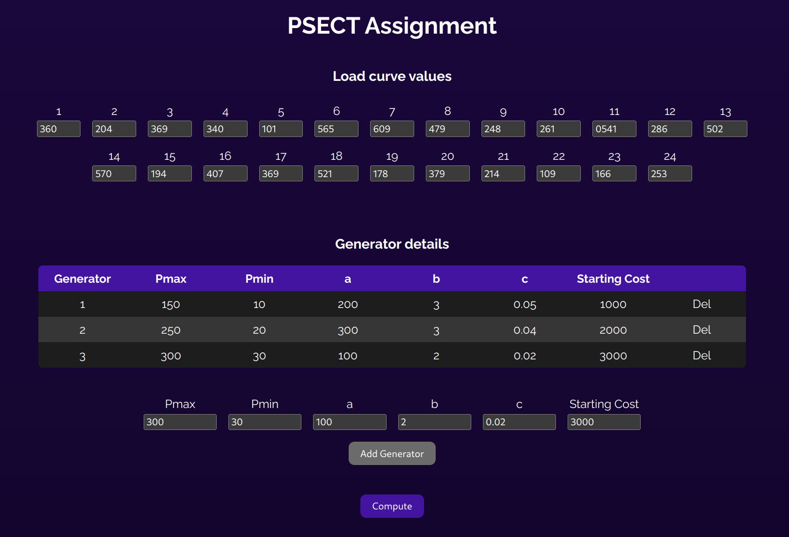
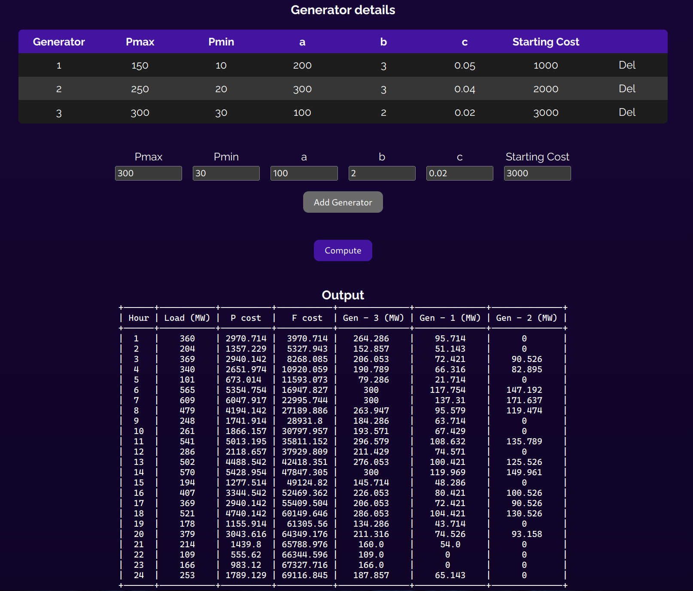

# PSECT Assignment - Unit Commitment
This assignment deals with the unit commitment problem. The program takes in N number of units that must be committed to meet a load demand of a commercial area in a day, the area's load curve and the generation cost characteristics and generation limits of all the generators to output a priority list based on Full Load Average Production Cost (FLAPC) for committing the units to meet the demand.

### Contributors
- Roshan B (107119104)
- Vignesh S (107119134)
- V Prakash (107119136)

### Requirements
- node.js
- yarn (Install using npm)
- python and pip

### Setup
```bash
cd frontend && yarn
cd backend && source bin/activate && pip install -r requirements.txt
```

Alternatively, run the setup script
```bash
chmod +x setup.sh
./setup.sh
```

### Starting the website and the backend
```bash
cd frontend && yarn dev
cd backend && source bin/activate && python app.py
```

### Technologies used
- React and CSS to create the user interface
- Flask server to execute the python script and to receive/send the input/ouput data from/to the frontend

### Screenshots
Input:


Output:

